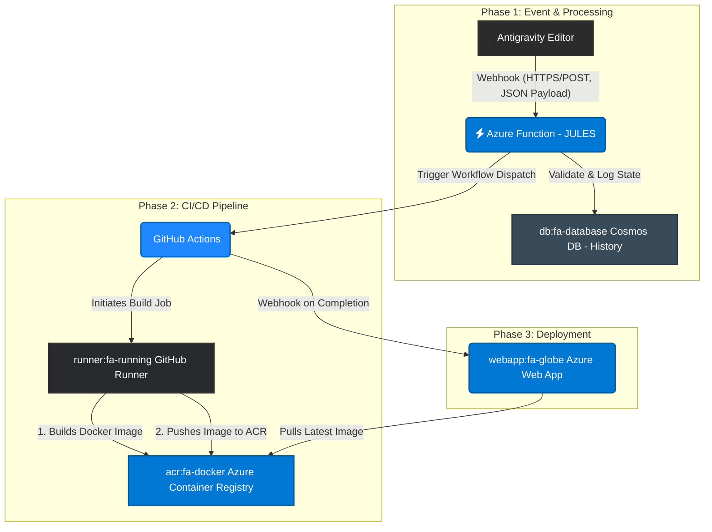

```mermaid
graph TD;
    subgraph "Phase 1: Event & Processing"
        A[Antigravity Editor] -- "Webhook (HTTPS/POST, JSON Payload)" --> B(fa:fa-bolt Azure Function - JULES);
        B -- "Validate & Log State" --> C[db:fa-database Cosmos DB - History];
    end

    subgraph "Phase 2: CI/CD Pipeline"
        B -- "Trigger Workflow Dispatch" --> D(fab:fa-github-actions GitHub Actions);
        D -- "Initiates Build Job" --> E[runner:fa-running GitHub Runner];
        E -- "1. Builds Docker Image" --> F[acr:fa-docker Azure Container Registry];
        E -- "2. Pushes Image to ACR" --> F;
    end

    subgraph "Phase 3: Deployment"
        D -- "Webhook on Completion" --> G(webapp:fa-globe Azure Web App);
        G -- "Pulls Latest Image" --> F;
    end

    style A fill:#2b2b2b,stroke:#333,stroke-width:2px,color:#fff
    style B fill:#0078D4,stroke:#005A9E,stroke-width:2px,color:#fff
    style C fill:#394B59,stroke:#2C3A47,stroke-width:2px,color:#fff
    style D fill:#2088FF,stroke:#0066CC,stroke-width:2px,color:#fff
    style E fill:#282a2e,stroke:#333,stroke-width:2px,color:#fff
    style F fill:#0078D4,stroke:#005A9E,stroke-width:2px,color:#fff
    style G fill:#0078D4,stroke:#005A9E,stroke-width:2px,color:#fff
```
