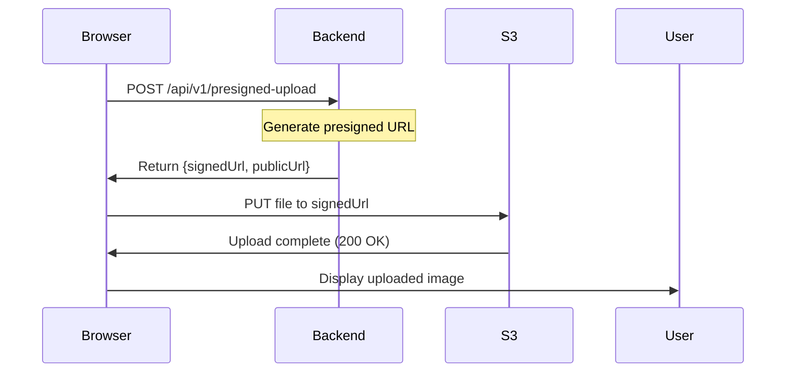

# 🚀 GreenChainz Uploader - System Check Guide

## ✅ What We Built

A professional, production-ready **Assets Vault** with glassmorphism UI:

1. **Backend Presigned URL API** - Secure, scalable S3 uploads without server bandwidth
2. **React Upload Component** - Beautiful glassmorphism UI with loading states
3. **S3 Integration** - Direct browser-to-AWS uploads (zero backend bottleneck)

---

## 📋 CEO Checklist: Get It Running

### **Step 1: Install Backend Dependencies**

```powershell
cd backend
npm install
```

This installs the new `@aws-sdk/s3-request-presigner` package.

---

### **Step 2: Configure AWS Credentials**

**Option A: Using `.env` file (Recommended for Dev)**

Create or update `d:\perplexitydownloads\green-sourcing-b2b-app\.env`:

```dotenv
# AWS S3 Configuration
AWS_ACCESS_KEY_ID=your-aws-access-key-id
AWS_SECRET_ACCESS_KEY=your-aws-secret-access-key
AWS_REGION=us-east-1
S3_BUCKET_NAME=greenchainz-assets

# Backend
PORT=3001
JWT_SECRET=your-jwt-secret-here

# Database
DB_USER=user
DB_PASSWORD=password
DB_NAME=greenchainz_dev
POSTGRES_HOST=localhost

# Frontend
FRONTEND_URL=http://localhost:5173
```

**Option B: Using AWS CLI (if you have AWS configured)**

The SDK will automatically use your AWS credentials from `~/.aws/credentials`.

---

### **Step 3: Create S3 Bucket (If You Haven't Already)**

1. Go to: https://console.aws.amazon.com/s3
2. Click **Create bucket**
3. Bucket name: `greenchainz-assets` (or whatever you set in `.env`)
4. Region: `us-east-1` (or match your `.env` AWS_REGION)
5. **Block Public Access**: Keep it ON (we use presigned URLs)
6. Click **Create bucket**

**CORS Configuration (Required for Browser Uploads)**:
- In your bucket → **Permissions** → **CORS**
- Add this configuration:

```json
[
    {
        "AllowedHeaders": ["*"],
        "AllowedMethods": ["PUT", "POST", "GET"],
        "AllowedOrigins": ["http://localhost:5173", "http://localhost:3000"],
        "ExposeHeaders": ["ETag"]
    }
]
```

---

### **Step 4: Start Backend Server**

```powershell
cd backend
npm start
```

**Expected Output:**
```
Server running on port 3001
✅ Database connected
```

---

### **Step 5: Start Frontend Dev Server**

Open a **new PowerShell terminal**:

```powershell
cd frontend
npm run dev
```

**Expected Output:**
```
VITE v7.x.x ready in Xms

➜  Local:   http://localhost:5173/
```

---

### **Step 6: Access the Upload Test Page**

Open your browser:

```
http://localhost:5173/test/s3
```

**What You Should See:**
- **Title**: "GreenChainz Alpha"
- **Subtitle**: "System Check: S3 Asset Pipeline"
- **Glass-effect card** with file upload input
- **Green gradient button**: "Upload to S3"

---

### **Step 7: Test the Upload**

1. **Click** "Choose File"
2. **Select** an image (JPEG, PNG, WebP) or PDF
3. **Click** "Upload to S3"
4. **Watch** the spinner animation
5. **Success Alert**: "Success! File secured in the Vault."
6. **Image Preview** appears below with the S3 URL

---

## 🔍 Troubleshooting

### **Error: "Failed to get presigned URL"**

**Cause**: Backend not running or wrong API URL

**Fix**:
```powershell
# Check backend is running
cd backend
npm start

# Verify .env has correct values
# FRONTEND_URL=http://localhost:5173
```

---

### **Error: "Upload to S3 failed"**

**Causes**:
1. **CORS not configured** on S3 bucket
2. **Wrong AWS credentials** in `.env`
3. **Bucket doesn't exist**

**Fix**:
1. Verify bucket exists in AWS Console
2. Check CORS configuration (Step 3 above)
3. Verify AWS credentials in `.env`

---

### **Error: "Authorization header missing"**

**Cause**: You need to be logged in (JWT token required)

**Fix**:
1. Go to: `http://localhost:5173/login`
2. Login with your account
3. Go back to: `http://localhost:5173/test/s3`
4. Try uploading again

**Quick Test Without Auth** (for dev only):

Temporarily disable auth in `backend/routes/presigned-upload.js`:

```javascript
// Change this line:
router.post('/', authenticateToken, async (req, res) => {

// To this:
router.post('/', async (req, res) => {
```

⚠️ **Remember to re-enable auth after testing!**

---

## 🎨 What's Glassmorphism?

The component uses the **glassmorphism design system** defined in:
- `frontend/src/glassmorphism.css`

**Key CSS Classes Used:**
- `.glass-effect` - Frosted glass background with blur
- `.btn-primary` - Green gradient button with hover effects
- `.text-gradient` - Green gradient text
- `.spinner` - Loading animation
- `.fade-in` - Smooth appearance animation

---

## 📊 What Happens Behind the Scenes?

### **Upload Flow:**



### **Why Presigned URLs?**

✅ **Zero Backend Bandwidth** - Files go directly to S3
✅ **Faster Uploads** - No backend bottleneck
✅ **Scalable** - Handles 1000s of concurrent uploads
✅ **Secure** - URLs expire in 5 minutes
✅ **Cost-Effective** - No EC2 data transfer costs

---

## 🎯 Next Steps

Once this test succeeds, we'll:
1. ✅ **Integrate into Supplier Dashboard** - Product photo uploads
2. ✅ **Add PDF Support** - EPD certificate uploads
3. ✅ **Build Gallery View** - Display all uploaded assets
4. ✅ **Connect to MailerLite** - Email verification for suppliers

---

## 🐛 Report Back Format

**If SUCCESS:**
```
✅ Upload successful!
Image URL: https://greenchainz-assets.s3.us-east-1.amazonaws.com/products/abc123.jpg
```

**If ERROR:**
```
❌ Error: [exact error message from console]
Browser console logs: [paste errors]
Backend terminal logs: [paste errors]
```

---

## 📁 Files Created

**Frontend:**
- `frontend/src/glassmorphism.css` - Design system
- `frontend/src/components/ImageUpload.tsx` - Upload component
- `frontend/src/pages/S3Test.tsx` - Test page
- `frontend/src/lib/s3-upload.ts` - Upload utility

**Backend:**
- `backend/routes/presigned-upload.js` - Presigned URL route
- `backend/services/s3.js` - Updated with presigned URL function

**Configuration:**
- `.env.example` - Added AWS S3 variables
- `backend/package.json` - Added `@aws-sdk/s3-request-presigner`
- `frontend/src/App.tsx` - Added `/test/s3` route

---

## 💡 Pro Tips

1. **Check Network Tab**: Open DevTools → Network to see API calls
2. **Console Logs**: Watch for "✅ Upload Successful:" message
3. **S3 Console**: Verify files appear in AWS S3 bucket
4. **Token Expiry**: If auth fails, try logging in again

---

**Status**: ⏳ Awaiting CEO test results

**Next Phase**: MailerLite Integration 📧
