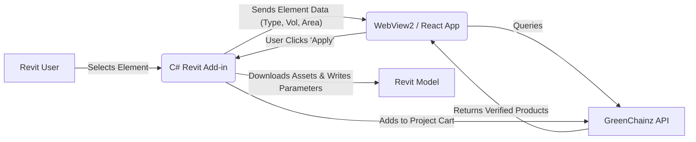

# Revit Specifier Plugin: Technical Specification

## Overview
A Revit add-in that allows users to search the GreenChainz database for sustainable materials and apply them to Revit elements. It utilizes a **Dockable Pane** UI to remain persistent during the design session.

## User Interface (UI)
The UI will be built using **WebView2** (Edge Chromium embedded), allowing us to use **React** for the interface. This ensures the "Search" and "Filter" experience matches the main GreenChainz web app.

### Components:
1.  **Selection Watcher:** Reacts to user selection in the Revit viewport.
    *   *If Wall selected:* Shows matching Wall Types (Insulation, Gypsum, Concrete).
    *   *If Empty:* Shows general search/browse.
2.  **Product Card:** Displays Image, GWP, Cost (est), and "Apply" button.
3.  **Project Cart:** A "shopping cart" of selected materials to be exported for RFQ.

## Architecture



## Data Integration Details

### 1. Revit -> App (Context)
When a user selects an object, we send a JSON payload to the WebView:
```json
{
  "category": "Walls",
  "family": "Basic Wall",
  "type": "Generic - 8\"",
  "width_mm": 203.2,
  "volume_m3": 12.5,
  "area_m2": 45.0
}
```

### 2. App -> API (Search)
The React app queries GreenChainz:
`GET /api/products/search?category=insulation&thickness_min=200&gwp_max=5.0`

### 3. App -> Revit (Apply)
When "Apply" is clicked, WebView sends an event to C# host:
```json
{
  "action": "APPLY_MATERIAL",
  "material_data": {
    "name": "Owens Corning EcoTouch",
    "manufacturer": "Owens Corning",
    "gwp": 4.5,
    "url": "https://greenchainz.com/product/123",
    "asset_path": "https://greenchainz.com/assets/textures/123.jpg"
  }
}
```

## Monetization Hook ("Get Paid")
The "Project Cart" feature collects all applied materials.
*   **Action:** User clicks "Send RFQ to Suppliers" in the plugin.
*   **Result:** Opens `greenchainz.com/rfq/create?project_id=xyz`.
*   **Revenue:** This generates high-value leads for suppliers (Monetized via subscription or lead fee).

## MVP Scope (Phase 1)
1.  **C# Boilerplate:** Register Dockable Pane, integrate WebView2.
2.  **WebView App:** Simple search bar hitting a mock API.
3.  **One-Way Comm:** Read selection from Revit and display in WebView.
4.  **Parameter Write:** Write simple strings ("GreenChainz ID") to the selected element.
