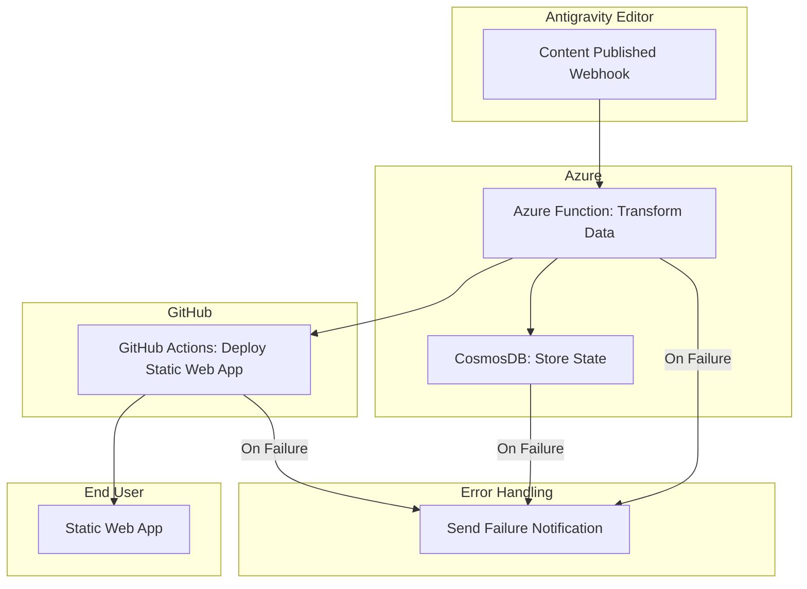

```mermaid
graph TD
    subgraph "Antigravity Editor"
        A[Content Published Webhook]
    end

    subgraph "Azure"
        B[Azure Function: Transform Data]
        C[CosmosDB: Store State]
    end

    subgraph "GitHub"
        D[GitHub Actions: Deploy Static Web App]
    end

    subgraph "End User"
        E[Static Web App]
    end

    A --> B
    B --> D
    B --> C
    D --> E

    subgraph "Error Handling"
        F[Send Failure Notification]
    end

    B -- "On Failure" --> F
    D -- "On Failure" --> F
    C -- "On Failure" --> F
```
